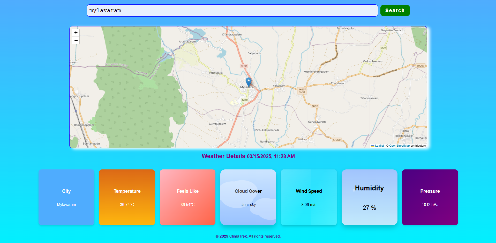

# 🌤 # ClimaTrek - Weather App

## 📌 Introduction
This Weather App provides real-time weather information for any location. Users can search for a city by name or select a location directly on an interactive map to fetch weather details. The app integrates **OpenWeatherMap API** to retrieve accurate weather data and presents it in an intuitive UI.

## 🚀 Features
- **Search & Map Selection**: Enter a city name or click on the map to get weather updates.
- **Real-Time Weather Data**: Fetches live weather details including:
  - 🌍 City Name
  - 🌡 Temperature
  - 🔥 Feels Like Temperature
  - ☁ Cloud Cover Description
  - 💨 Wind Speed
  - 💦 Humidity Percentage
  - 📏 Pressure (hPa)
- **Live Timestamp**: Displays the exact time of the last fetched weather data.
- **User-Friendly UI**: Designed with a modern gradient theme for a clean and engaging experience.

## 🛠 Technologies Used
- **Frontend**: HTML, CSS, JavaScript
- **Backend**: Node.js with Express
- **APIs**: OpenWeatherMap API
- **Mapping**: Leaflet.js with OpenStreetMap

## 📂 Project Structure
```
/weather-app
│-- public/
│   ├── css/ (Stylesheets)
│   ├── js/ (Frontend scripts)
│   ├── images/ (Assets)
│-- views/
│   ├── index.ejs (Main UI)
│-- server.js (Backend logic with Express)
│-- package.json (Dependencies & scripts)
```

## 📌 Usage
1. **Clone the Repository**
   ```bash
   git clone https://github.com/MALLIKHARJUNCHILUKURI-02/Weather-App-Unified-Mentor-Project.git
   cd weather-app
   ```
2. **Install Dependencies**
   ```bash
   npm install
   ```
3. **Run the App**
   ```bash
   node server.js
   ```
4. **Open in Browser**
   ```
   http://localhost:3000
   ```
5. **Search for a city** or **Click on the map** to view live weather details.


## Troubleshooting: Map Not Loading
If the map is not loading, it may be due to Leaflet not being loaded correctly. Follow these steps:

### 1. Check Console Errors
- Open Developer Tools (`F12` or `Ctrl + Shift + I`).
- Check the **Console** for errors like `L is not defined`.
- If there's a network issue, go to the **Network → JS** tab and check if `leaflet.js` is loaded.

### 2. Replace Leaflet CDN
If the default CDN is not working, replace it with a different one.

#### Default CDN:
```html
<script src="https://unpkg.com/leaflet/dist/leaflet.js"></script>
<link rel="stylesheet" href="https://unpkg.com/leaflet/dist/leaflet.css" />
```

#### Alternative CDN (Use this if the map does not load):
```html
<script src="https://cdnjs.cloudflare.com/ajax/libs/leaflet/1.9.4/leaflet.js"></script>
<link rel="stylesheet" href="https://cdnjs.cloudflare.com/ajax/libs/leaflet/1.9.4/leaflet.css" />
```

### 3. Use Local Leaflet Files
If the issue persists, download **Leaflet.js** and **Leaflet.css** from [Leaflet's official website](https://leafletjs.com/download.html) and include them in your project:
```html
<link rel="stylesheet" href="leaflet.css" />
<script src="leaflet.js"></script>
```

## Preview



## 🎥 Demo Video  
[Watch the Demo](https://drive.google.com/file/d/1D-72K4M17Q6GKRC8gNwo0wFAQbIZm8H/view?usp=sharing)


## Author
[Mallikharjun Reddy Chilukuri] - [GitHub Profile](https://github.com/MALLIKHARJUNCHILUKURI-02)


## ⚡ Future Enhancements
- Add **7-day forecast** with graphical charts.
- Implement **user location detection** for instant weather updates.
- Introduce **multiple language support**.
- Improve UI with **dark mode toggle**.

---
